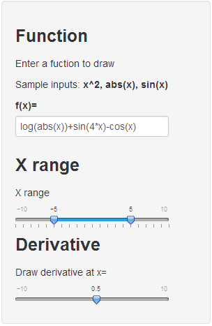
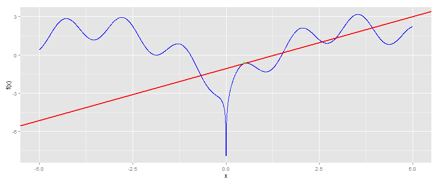
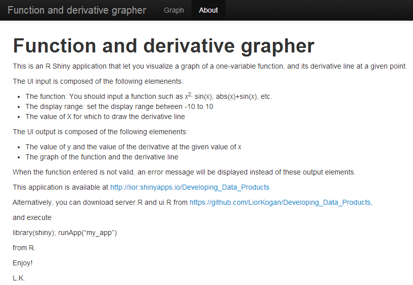

## Function and Derivative Grapher

This web application allows you to

* Input a single-variable function (e.g. f(x)= x^2+sin(x)+3)

* View the graph of the function

* Select a value for x, and view the derivative line of f(x) for that point

Sounds interesting? read on...

---

## Input Panel ##

In this panel, the user can:

* Input the function he wants to draw.   
  This should be a single-variable (x) function.   
  The function is evaluated directly by R.
  
* Select the X-range of the graph to be drawn

* Select the value of x for which a derivative-line should be drawn

---

## Output Panel

Plot of f(x) = log(abs(x))+sin(4*x)-cos(x) for x between -5 and 5:   
The derivative of f(x) at (0.5, -0.661) is 0.815   
 

 * Note: this graph is rendered when compiling the presentation (see source)   
   This is not a screen capture!

---

## About Screen

